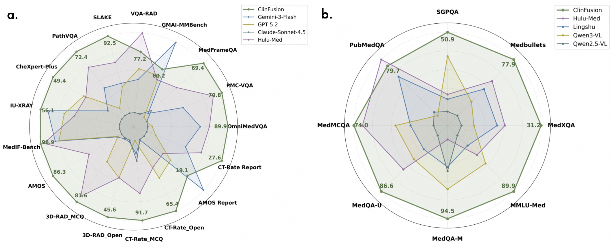
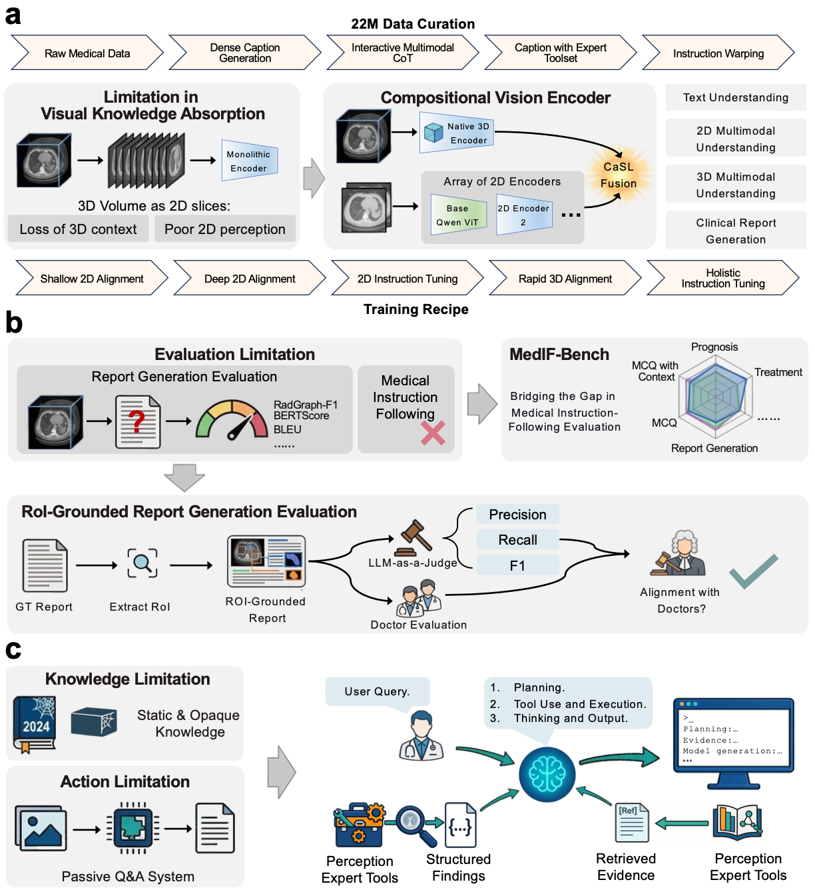

<div align="center">

# 🏥 ClinFusion

**A Vision-Centric Multimodal LLM System for Holistic Medical Understanding**

[](https://arxiv.org/abs/2607.24743)
[](https://huggingface.co/collections/Alibaba-DAMO-Academy/clinfusion)
[](https://huggingface.co/spaces/hugging-apps/clinfusion-medical-vlm)

[](LICENSE)
[](https://www.python.org/)
[](https://huggingface.co/docs/transformers)

<details>
  <summary><strong>📘 Click to view Abstract</strong></summary>
  <div align="left">

> Multimodal large language models (MLLMs) hold immense potential to revolutionize clinical practice, yet deploying them in the medical domain is fundamentally a vision-centric challenge: models must absorb knowledge from heterogeneous 2D and 3D medical images, and evaluation protocols must align with radiologists' clinical practice and provide an accurate, fine-grained and factualness-driven assessment. In this paper, we introduce ClinFusion, a vision-centric MLLM designed for holistic medical understanding that systematically addresses these limitations. We propose a compositional and cascaded vision encoder architecture featuring a Cascade Spatial-Aware Locality Fusion operator that unifies diverse 2D and native 3D medical image understanding within a fused encoder. We further introduce a vision-grounded evaluation framework, including MedIF-Bench for instruction-following assessment and a region-of-interest-grounded method for clinically aligned and factualness-driven report generation evaluation. We show that ClinFusion sets a new state-of-the-art across a comprehensive suite of 2D and 3D multimodal medical benchmarks—spanning visual question answering, report generation, and instruction following—as well as textual medical tasks, outperforming leading open-source medical MLLMs (e.g., Hulu-Med, Lingshu) on 20 out of 24 benchmarks and demonstrating multimodal capabilities better than powerful proprietary models such as GPT-5.2 and Gemini-3-Flash on 13 out of 16 benchmarks, and can be further augmented with agentic tool use for retrieval-augmented and tool-assisted clinical workflows. A blinded evaluation by board-certified radiologists confirms that ClinFusion produces the highest-ranked reports, and validates our RoI-grounded metric as achieving the strongest correlation with expert judgment among all automatic evaluation metrics examined.

  </div>
</details>

</div>

<p align="center">
  
</p>
<p align="center">
  <sub><b>(a)</b> Performance on multimodal medical benchmarks. &nbsp; <b>(b)</b> Performance on text-only medical benchmarks.</sub>
</p>

<p align="center">
  
</p>
<p align="center">
  <sub><b>(a)</b> Data curation, compositional vision encoder, and training recipe. &nbsp; <b>(b)</b> Vision-grounded evaluation framework (MedIF-Bench and RoI-grounded report evaluation). &nbsp; <b>(c)</b> Agentic tool use for retrieval-augmented clinical workflows.</sub>
</p>

---
## 🔥 News


- **[2026-07]** 🔥 Try ClinFusion-8B in your browser! [](https://huggingface.co/spaces/hugging-apps/clinfusion-medical-vlm) — no installation required. 🕹️

- **[2026-07-28]** 🎉 Our paper **ClinFusion: A Vision-Centric Multimodal LLM System for Holistic Medical Understanding** is now on [arXiv](https://arxiv.org/abs/2607.24743)! We have open-sourced the code and released the model weights (ClinFusion-8B / ClinFusion-32B) on [Hugging Face](https://huggingface.co/collections/Alibaba-DAMO-Academy/clinfusion). 🚀


---

## 📋 Table of Contents

- [🔧 Installation](#-installation)
- [📥 Model Download](#-model-download)
- [📊 Dataset Download](#-dataset-download)
- [📈 Running ClinFusion-Eval](#-running-clinfusion-eval)
- [🚀 Model Inference with Your Own Data](#-model-inference-with-your-own-data)
- [🛠️ More Customized Usage](#️-more-customized-usage)
- [📄 Citation](#-citation)
- [🙏 Acknowledgements](#-acknowledgements)
---

## 🔧 Installation

### Prerequisites: Download Pre-built Flash-Attention

Flash-Attention cannot be installed directly via pip and must be provided as a pre-built wheel. Download the wheel that matches your environment from:

> **https://mjunya.com/flash-attention-prebuild-wheels/**

Choose the wheel matching your **CUDA version**, **PyTorch version**, and **Python version** (e.g., `flash_attn-2.8.3+cu128torch2.8-cp311-cp311-linux_x86_64.whl` for CUDA 12.8 + PyTorch 2.8 + Python 3.11), and place it in the **project root directory**.

Make sure the filename in `requirements.txt` matches the wheel you downloaded. If not, update the last line of `requirements.txt` accordingly.

### One-Click Install

We provide an installation script that automatically sets up the environment using [`uv`](https://github.com/astral-sh/uv):

```bash
# Install and activate in one step
source install_from_scratch.sh

# Or install only (prints activation command afterwards)
bash install_from_scratch.sh
```

The script will:
1. Install the `uv` package manager (if not already installed)
2. Create a Python 3.11 virtual environment （you should specify the environment path first `ENV_DIR` in `install_from_scratch.sh`）
3. Validate local wheel paths and install all dependencies from `requirements.txt`

---

## 📥 Model Download

### Prerequisites: Download Vision Encoders

ClinFusion uses multiple vision encoders. Please download them first:

```bash
export HF_ENDPOINT=https://hf-mirror.com
# 🦕 DINOv2
huggingface-cli download --resume-download facebook/dinov2-large \
    --repo-type model \
    --local-dir cache/models/dinov2-large

# 🔬 ConvNeXt
huggingface-cli download --resume-download laion/CLIP-convnext_large_d_320.laion2B-s29B-b131K-ft-soup \
    --repo-type model \
    --local-dir cache/models/CLIP-convnext_large_d_320.laion2B-s29B-b131K-ft-soup
```

### Download Base LLM

```bash
export HF_ENDPOINT=https://hf-mirror.com
# Qwen3-VL-8B-Instruct (for 8B model)
huggingface-cli download --resume-download Qwen/Qwen3-VL-8B-Instruct \
    --repo-type model \
    --local-dir cache/models/Qwen3-VL-8B-Instruct

# Qwen3-VL-32B-Instruct (for 32B model)
huggingface-cli download --resume-download Qwen/Qwen3-VL-32B-Instruct \
    --repo-type model \
    --local-dir cache/models/Qwen3-VL-32B-Instruct
```

### Download ClinFusion Checkpoints

```bash
export HF_ENDPOINT=https://hf-mirror.com
# ClinFusion-8B
huggingface-cli download --resume-download Alibaba-DAMO-Academy/ClinFusion-8B \
    --repo-type model \
    --local-dir cache/models/ClinFusion-8B

# ClinFusion-32B
huggingface-cli download --resume-download Alibaba-DAMO-Academy/ClinFusion-32B \
    --repo-type model \
    --local-dir cache/models/ClinFusion-32B
```

---

## 📊 Evaluation Dataset Download

> 🚧 *Coming soon...*

---

## 📈 Running ClinFusion-Eval

### Step 1: Configure API Keys and Python Path 

Fill in the API keys in `eval/api_keys/api_key.ak`.

Modify the `base_url:` in your yaml file to specify the base URL of the API.

Modify the python path `python_executable:` in your yaml file to specify the python path in your environment.

### Step 2: Run Evaluation

```bash
cd ClinFusion
```

| Benchmark Type | Command |
|---|---|
| 🖼️ **2D & Textual** | `bash eval/tools/launch_eval_clinfusion_2d_general.sh` |
| 🧊 **3D Volumetric** | `bash eval/tools/launch_eval_clinfusion_3d.sh` |
| 📝 **Instruction-Following** | `bash eval/tools/launch_eval_clinfusion_if.sh` |

> [!TIP]
> **3D evaluation can be time-consuming.** We provide a **lite version** for faster iteration. Switch by modifying `eval_data_path` in `eval/Evaluation/config_templates/clinfusion/config_3d_clinfusion.yaml`:
>
> ```yaml
> # Full version
> eval_data_path: "eval/Evaluation/datasets/3d_eval_data_ct-rate_amos_3d-rad.jsonl"
> # Lite version (recommended for quick testing)
> eval_data_path: "eval/Evaluation/datasets/3d_eval_data_ct-rate_amos_3d-rad_lite.jsonl"
> ```

---

## 🚀 Model Inference with Your Own Data

This section explains how to run ClinFusion inference on your own data. Before running, modify `python_executable:` in your YAML config file to point to your Python environment.

### 📝 Data Format

All input data should be in **JSONL format** (one JSON object per line). Each entry must contain a `messages` field with the following structure:

```json
{
  "messages": {
    "prompt": "Your question or instruction here.",
    "image": ["path/to/image1.jpg", "path/to/image2.png"],
    "nifti": ["path/to/volume.nii.gz"]
  }
}
```

- **`prompt`** *(required)*: The text query or instruction for the model.
- **`image`** *(optional)*: A list of paths to 2D image files (e.g., `.jpg`, `.png`). Omit this field for text-only or 3D-only inputs.
- **`nifti`** *(optional)*: A list of paths to 3D NIfTI volumes (`.nii.gz`). Omit this field for text-only or 2D-only inputs.

> [!NOTE]
> You can include any additional fields (e.g., `source`, `index`, `ground_truth`) in each JSON object for your own bookkeeping — they will be preserved in the output file alongside the model's generation.

### 🖼️ 2D Medical Images

Prepare a JSONL file where each line contains a `messages` field with `prompt` and `image`:

```json
{"messages": {"prompt": "What imaging modality was used in the diagnosis?\nA. X-ray\nB. Ultrasound\nC. MRI\nD. CT scan\n\nPut your final single letter choice in \\boxed{}.", "image": ["assets/example_data/PMC3610355_fig14.jpg"]}}
{"messages": {"prompt": "Where does the image represent in the body?", "image": ["assets/example_data/xmlab508_source.jpg"]}}
```
It is placed in `eval/test/example_data_2d_general.jsonl`.
Then create a YAML config file (see `eval/test/test_clinfusion_2d_general.yaml` as a template) and run:

```bash
cd ClinFusion
bash eval/tools/launch_inference.sh eval/test/test_clinfusion_2d_general.yaml
```

Key config fields to modify:
| Field | Description |
|---|---|
| `python_executable` | Path to your Python binary |
| `input_data_path` | Path to your JSONL data file |
| `final_output_path` | Directory for output results |
| `model_path` | Path to store the ClinFusion checkpoint |


### 💬 Language-Only (Text)

For text-only questions (no images), simply omit both `image` and `nifti` fields:

```json
{"messages": {"prompt": "A 41-year-old man presents to his primary care provider after seeing bright red blood in the toilet bowl after his last 2 bowel movements. He reports that he also noticed some blood mixed with his stool. The patient denies abdominal pain or any changes in his stool habits. He notes a weight loss of 8 pounds in the last 2 months with no changes in his diet or exercise habits. Which of the following is the most appropriate next step in management?\nA. Abdominal CT\nB. Colonoscopy\nC. Ultrasound of abdomen\nD. Barium enema"}}
```
It is placed in `eval/test/example_data_2d_general.jsonl`.
Run with the same 2D general config:

```bash
cd ClinFusion
bash eval/tools/launch_inference.sh eval/test/test_clinfusion_2d_general.yaml
```

### 🧊 3D Volumetric Data

For 3D CT/MRI volumes, use the `nifti` field instead of `image`. ClinFusion automatically converts NIfTI volumes into 2D slices for processing via `nifti_to_image_slices`.

```json
{"messages": {"prompt": "What can be inferred about the left iliac artery from the CT image?\nA. There is a significant dilation\nB. It is obscured by nearby structures\nC. It extends into an intramural hematoma\nD. There is a discontinuity in the vessel wall", "nifti": ["assets/example_data/amos_0326.nii.gz"]}}
```
It is placed in `eval/test/example_data_3d.jsonl`.
Run with the 3D config:

```bash
cd ClinFusion
bash eval/tools/launch_inference.sh eval/test/test_clinfusion_3d.yaml
```

### 📤 Output Format

Results are saved to `<final_output_path>/generation_output.jsonl`. Each line contains your original input fields plus a `model_generation` field with the model's response:

```json
{"messages": {"prompt": "...", "image": [...]}, "model_generation": "..."}
```

<!-- ### 🖼️ 2D Medical Images

讲一下data是怎么样的,example: 
```json
{
	"data_index": "93049",
	"meta_id": "PMC-VQA-28012",
	"messages": {
		"prompt": "What imaging modality was used in the diagnosis?\nA. X-ray\nB. Ultrasound\nC. MRI\nD. CT scan\n\nPut your final single letter choice in \\boxed{}.",
		"image": ["assets/example_data/PMC3610355_fig14.jpg"]
	}
}
{
	"source": "slake",
	"index": 797,
	"question": "Where does the image represent in the body?",
	"images_path": ["assets/example_data/xmlab508_source.jpg"],
}
```

```bash
cd ClinFusion
bash eval/tools/launch_inference.sh  eval/test/test_clinfusion_2d_general.yaml
```


### 💬 Language-Only (Text)

```json
{
	"source": "medbullets_op4",
	"index": 155,
	"language": "english",
	"question": "A 41-year-old man presents to his primary care provider after seeing bright red blood in the toilet bowl after his last 2 bowel movements. He reports that he also noticed some blood mixed with his stool. The patient denies abdominal pain or any changes in his stool habits. He notes a weight loss of 8 pounds in the last 2 months with no changes in his diet or exercise habits. His medical history is significant for an episode of pancreatitis 2 years ago for which he was hospitalized for several days. He drinks 2-3 beers on the weekend and he has never smoked. He has no family history of colon cancer. His temperature is 97.6°F (36.4°C), blood pressure is 135/78 mmHg, pulse is 88/min, and respirations are 14/min. On physical exam, his abdomen is soft and non-tender to palpation. Bowel sounds are present, and there is no hepatomegaly. Which of the following is the most appropriate next step in management?",
	"options": {
		"A": "Abdominal CT",
		"B": "Colonoscopy",
		"C": "Ultrasound of abdomen",
		"D": "Barium enema"
	},
}
```

```bash
cd ClinFusion
bash eval/tools/launch_inference.sh  eval/test/test_clinfusion_2d_general.yaml
```


### 🧊 3D Volumetric Data


```json
{
	"source": "amos-mm",
	"index": 11,
	"eval_method": "mcq",
	"language": "english",
	"question": "What can be inferred about the left iliac artery from the CT image?",
	"options": {
		"A": "There is a significant dilation",
		"B": "It is obscured by nearby structures",
		"C": "It extends into an intramural hematoma",
		"D": "There is a discontinuity in the vessel wall"
	},
	"ct_path": ["assets/example_data/amos_0326.nii.gz"]
}
```


```bash
cd ClinFusion
bash eval/tools/launch_inference.sh  eval/test/test_clinfusion_3d.yaml
``` -->


---

## 🛠️ More Customized Usage

### 🎯 Customization Options

| Component | How to Customize | Reference |
|---|---|---|
| **Aggregator** | Replace `aggregator_path` in config | See `Evaluation/aggregators/` |
| **Evaluator** | Replace `evaluator_path` in config | See `Evaluation/evaluators/` |
| **Dataset** | Follow the format in `Evaluation/datasets/` | MCQ context format supports RAG benchmarks |
| **3D Input** | All models support NIfTI file input via `nifti_to_image_slices` | See `InferenceEngine/models/utils.py` |

### 🔌 Custom Model Support

ClinFusion-Eval supports evaluating **any custom model** via the `model_type: "custom"` configuration:

```yaml
model_config:
  # 1. Set model_type to 'custom'
  model_type: "custom"
  # 2. Path to your fine-tuned model checkpoint
  model_path: "/path/to/checkpoint"
  # 3. Path to your adapter file (must define MedEvalKitAdapter)
  model_definition_path: "/path/to/medevalkit_adapter.py"
```

> [!NOTE]
> Define a `medevalkit_adapter.py` in your model directory. See `test/medevalkit_adapter.py` for an example. Verify your implementation with `python test/test_custom.py`.

**Example: Custom model inference**

You can refer to [🚀 Model Inference with Your Own Data](#-model-inference-with-your-own-data).

<!-- ```bash
cd ClinFusion
bash eval/tools/launch_inference.sh test/test_custom_inference.yaml
``` -->

**Example: Custom model evaluation**

You can follow `Running ClinFusion-Eval` to run evaluation with your custom model since ClinFusion is one kind of custom model.

### ⚡ Execution Modes (Single-Node & Multi-Node)

Both `launch_inference.sh` and `launch_eval.sh` support single-node and multi-node environments seamlessly.

- **Single-node**: Simply run `bash launch_inference.sh`.
- **Multi-node**: Environment variables (`RANK`, `WORLD_SIZE`, `MASTER_ADDR`, etc.) are automatically configured. Just run the same command.

> [!IMPORTANT]
> **For local models**: Ensure `cluster_config.total_gpus` in your `config.yaml` is set to the **total number of available GPUs** across all nodes. For example, 2 nodes × 8 GPUs = `16`.

#### 🔄 Dynamic Worker Allocation (Local Models Only)

Workers are dynamically allocated for optimal GPU utilization:

1. **Max available workers** = `total_gpus / gpus_per_worker`
2. **Max effective workers** = `len(dataset) / batch_size`
3. **Final worker count** = `min(1, 2)`

> [!TIP]
> To force more GPU parallelism on small datasets, **reduce `generation_config.batch_size`** — this increases the effective worker count.

---

## 📄 Citation

If you find ClinFusion useful in your research, please consider citing:

```bibtex
@article{yuan2026ClinFusion,
  title={ClinFusion: A Vision-Centric Multimodal LLM System for Holistic Medical Understanding},
  author={Yuan, Hangjie and Qian, Yichen and Tang, Zhiwei and Xu, Xianzhe and Wu, Lirong and Yang, Sicheng and Wang, Jinwang and Wang, Pengju and Zeng, Zhitao and Han, Yizeng and Xing, Yan and Luo, Shengxuan and Feng, Tao and Xie, Qing and Yao, Weigen and Yang, Yi and Liu, Zuozhu and Tang, Jiasheng and Wang, Shaocheng and Wang, Jitao and Dong, Jiahong and Chen, Weihua and Xu, Feng and Wang, Fan},
  journal={arXiv preprint arXiv:2607.24743},
  year={2026}
}
```

---

## 🙏 Acknowledgements

ClinFusion is built upon the following excellent open-source projects:

- [Qwen3-VL](https://github.com/QwenLM/Qwen2.5-VL) — Base vision-language model
- [DINOv2](https://github.com/facebookresearch/dinov2) — Self-supervised vision encoder
- [OpenCLIP](https://github.com/mlfoundations/open_clip) — ConvNeXt vision encoder

---

<div align="center">

**Made with ❤️ by Alibaba DAMO Academy**

</div>
